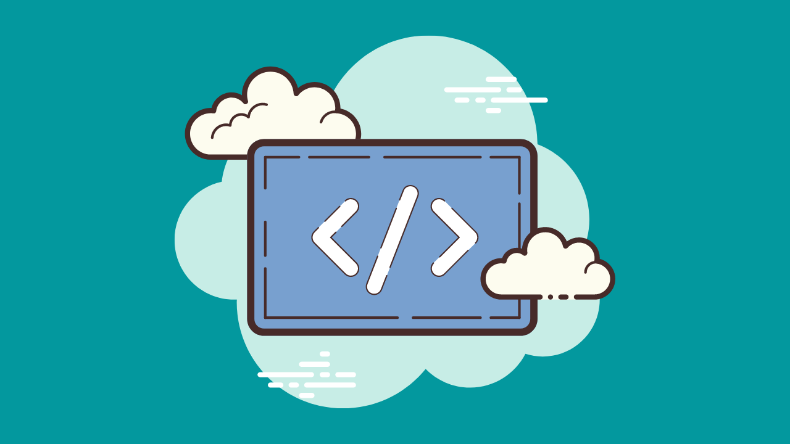

# 未経験から始めるC#入門
C#をまったくの未経験から学習する講座で作成したサンプルソースをダウンロードできるレポジトリになります。連載元のウェブページは「[未経験から始めるC#入門](https://hirofurukawa.com/category/cs/cd-first-step/)」になります。

「プログラミング学習を始めたいけれど、なにから始めてよいか分からない」

と感じている人は、ぜひとも当連載から手を付けてみてはいかがでしょうか。C#は書きやすいプログラミング言語であり、シンプルなアプリケーションならば簡単に作成することができます。

## サンプルコードのダウンロード方法
サンプルコードをダウンロードする方法は2種類あります。

1. ZIPファイルとしてウェブサイトからダウンロードする方法
1. GitHubからcloneしてローカル環境にダウンロードする方法

ここではZIPファイルからソースコードを確認する方法を紹介します。

### ZIPファイルでダウンロードする方法
GitHubのレポジトリからはZIP形式でファイルをダウンロードすることが可能です。その際は以下の手順に従って作業を行ってみてください。

#### １．GitHubページを開く
GitHubページから右上の「Code」ボタンを探してください。

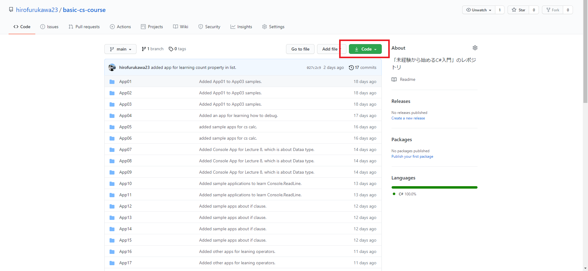

#### ２．「Download ZIP」を選択する
「Code」ボタンをクリックすると、いくつかのメニューが開かれます。中にある「Download ZIP」を選択してください。

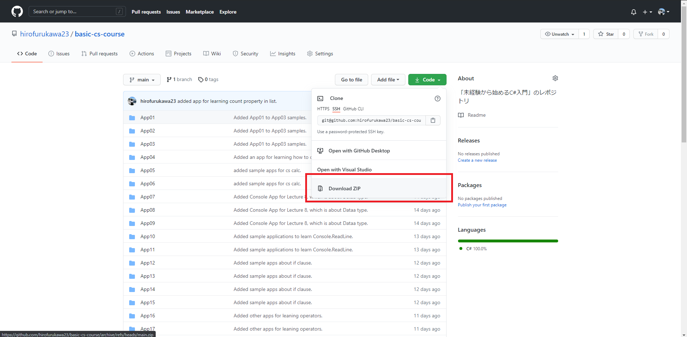

ボタンを選択するとダウンロードが自動で開始されます。

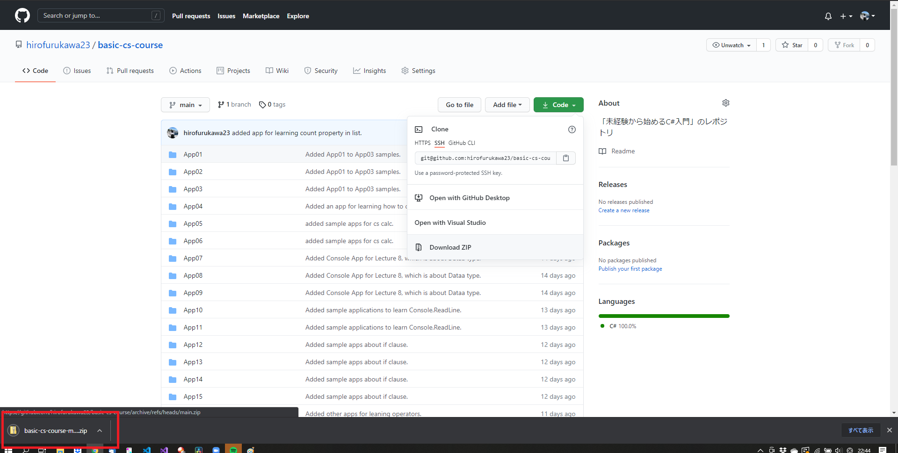

#### ３．ZIPファイルを解凍する
ダウンロードが完了したらZIPファイルを解凍します。ダウンロード先にある「basic-cs-course-main.zip」を探してください。

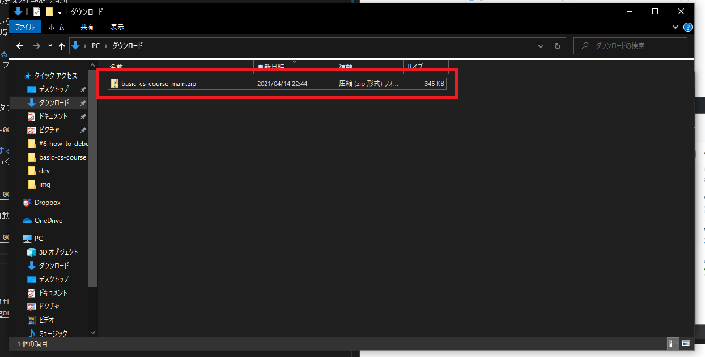

右クリックから「すべて展開」でZIPファイルの解凍が可能です。それ以外に独自の解凍方法を使用している人は、そちらを利用してZIPファイルを解凍してください。

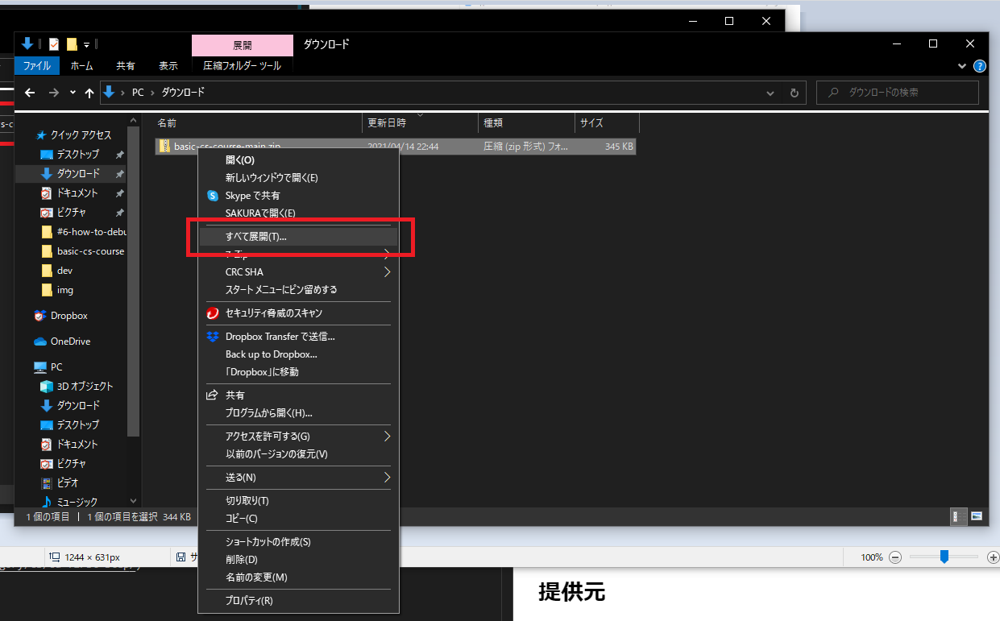

#### ４．フォルダを確認する
コードを確認したいフォルダを探しましょう。ウェブサイトのサンプルコードが書かれている部分の以下を確認します。

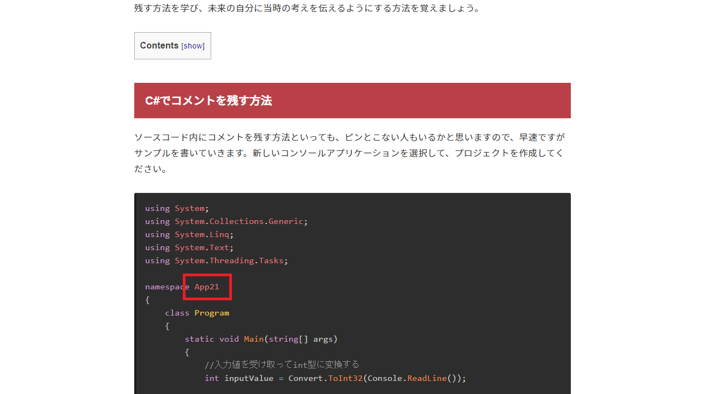

上記のファイルは「App21」なので、解凍したフォルダより「App21」を探しましょう。

#### ５．ソリューションファイルをクリックする
「basic-cs-course-main」フォルダを辿っていくと、「App〇〇」がズラッと並ぶ箇所にたどり着きます。先ほどのフォルダを探してください。

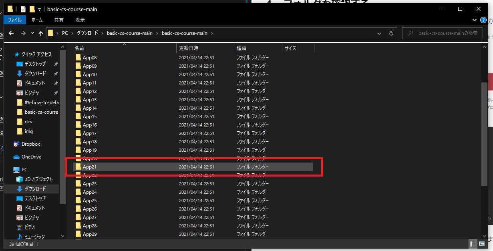

フォルダ内に「App〇〇.sin」というファイルが存在しますので、これをダブルクリックしてください。

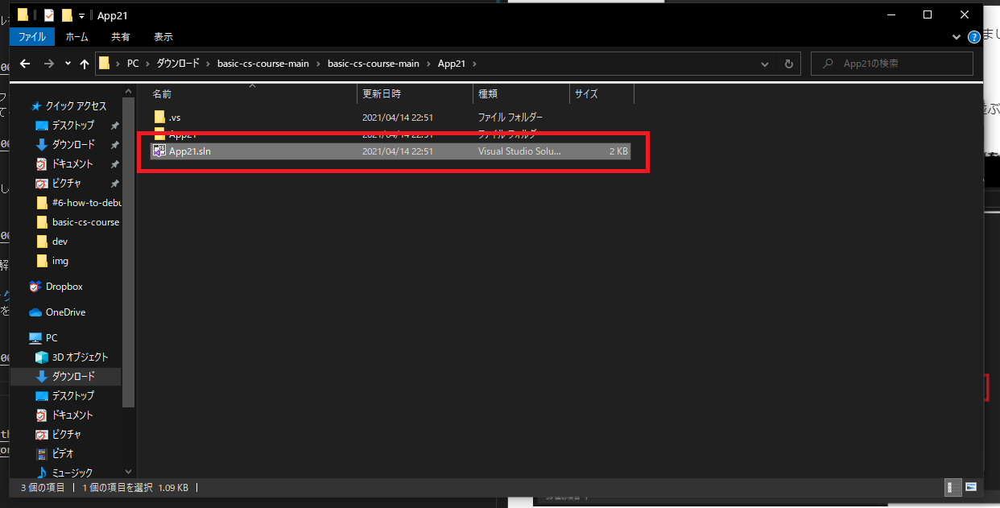

するとVisual Studioが起動しプログラムを確認することができます。

#### ６．メッセージで「OK」を選択
以下のようなメッセージが表示された場合は「OK」を選択してください。

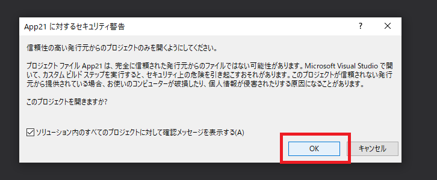

するとVisual Studioの起動が完了します。

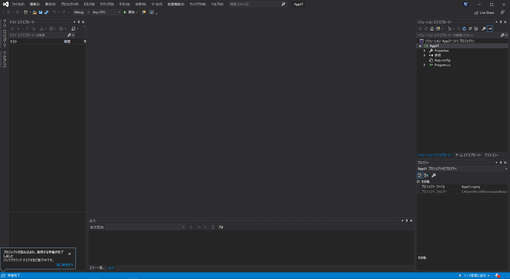

#### ７．program.csを選択
右側の「ソリューションエクスプローラー」と書かれたタブから「program.cs」をダブルクリックしてください。するとソースコードを確認できます。

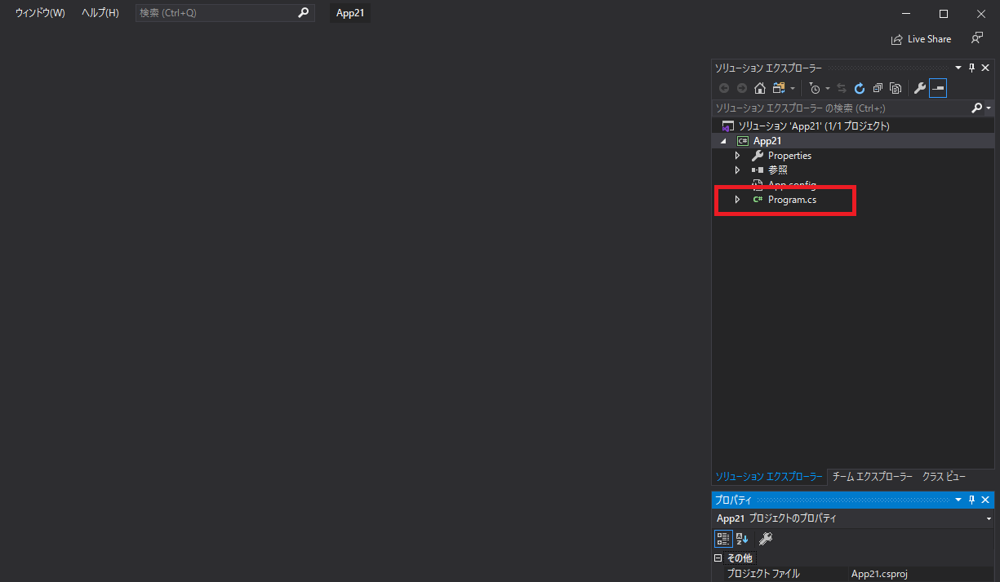

ソースコードが開けると以下のようになります。

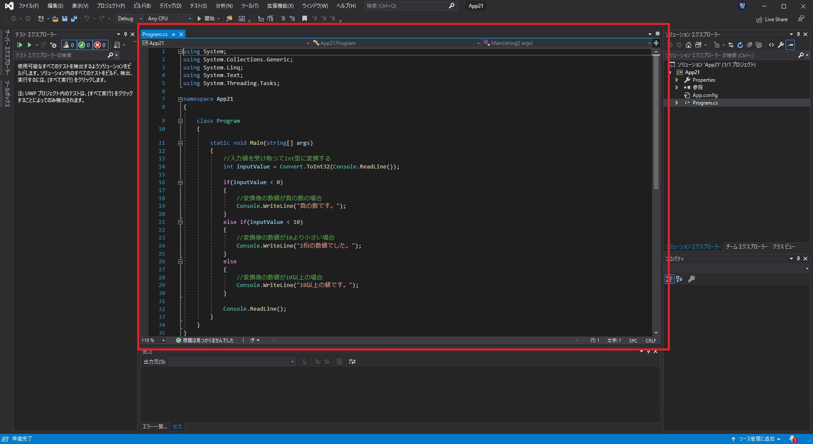

あとはこれまで通り「開始」ボタンからプログラムを実行することができます。

## 提供元
[HIRO OFFICIAL BLOG](https://github.com/hirofurukawa23/basic-cs-course) - [未経験から始めるC#入門](https://hirofurukawa.com/category/cs/cd-first-step/)
